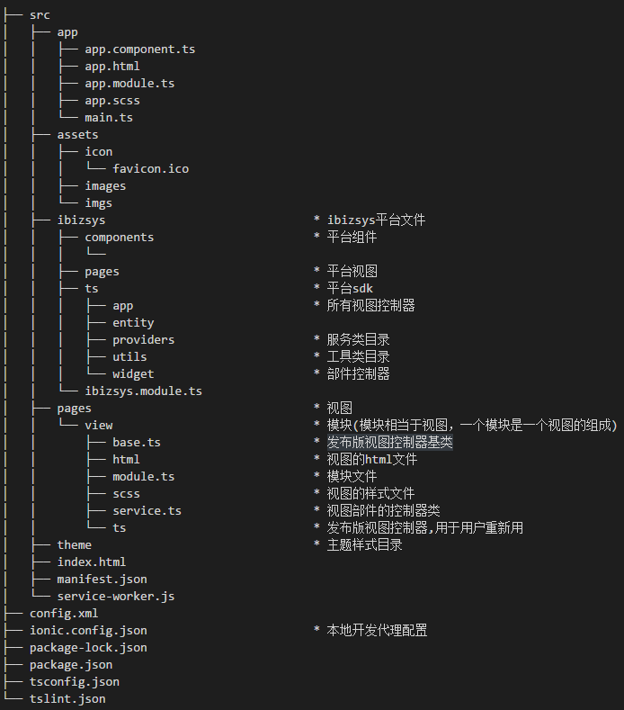
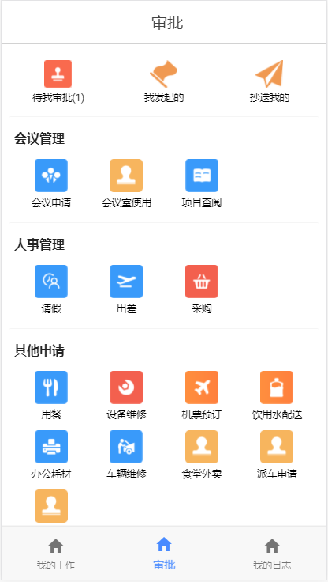
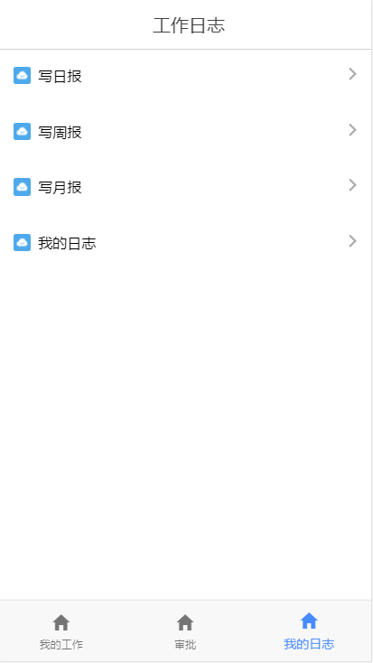
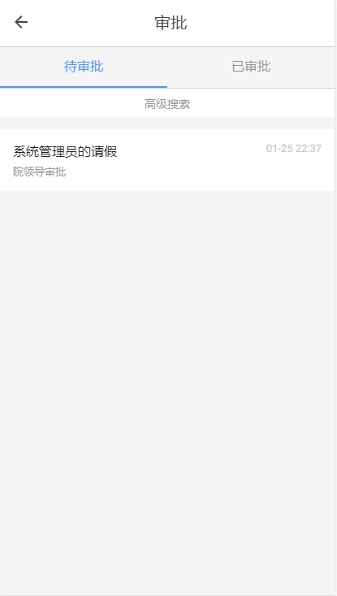
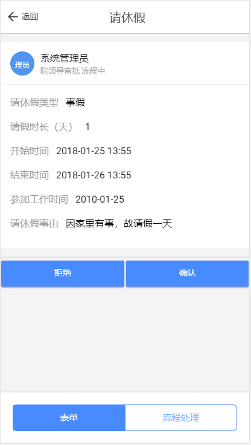
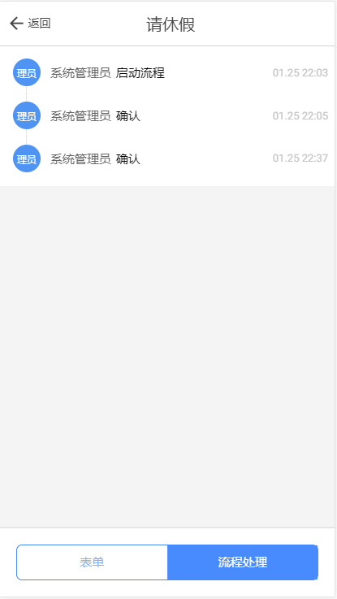

# iBizSys unip
[iBizSys软件云工厂](http://www.ibizsys.cn/ibizsys/indexview) OA系统
移动端、PC端、服务端

[项目预览(http://www.ibizsys.cn/Ionic/index.html)](http://www.ibizsys.cn/Ionic/index.html)

## 目录说明
> pub结尾项目为iBizSys平台生产代码，usr项目为开发过程中手写代码

> 移动端
>> * app_IonicApp_pub
>> * app_IonicApp_usr

> PC端
>> * app_app_pub
>> * app_app_usr

> 服务端
>> * srv_unip_pub
>> * srv_unip_usr
>> * sln_unip
>> * unip

> 资源文件夹
>> * project_source

## 移动端技术
> * Ionic-Angular

## 移动端项目结构

## 移动端概览

## PC端技术
> * jQuery

## 服务端技术
> * Spring
> * Spring mvc
> * hibernate

